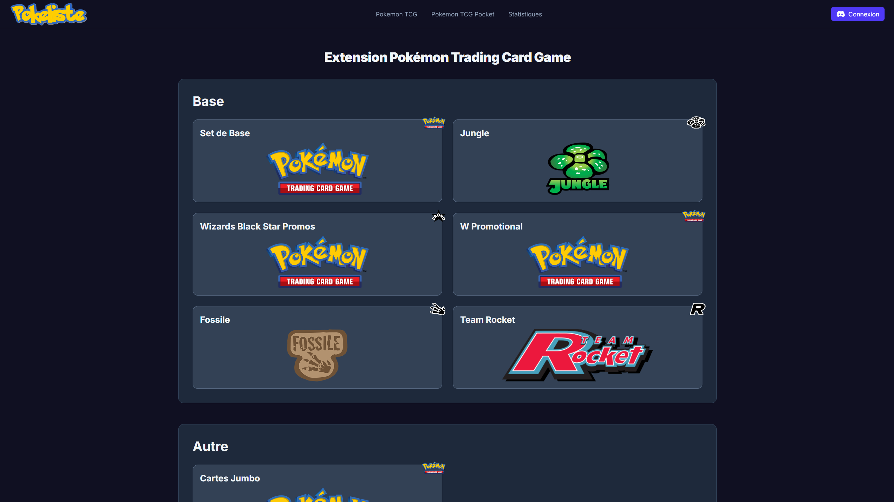
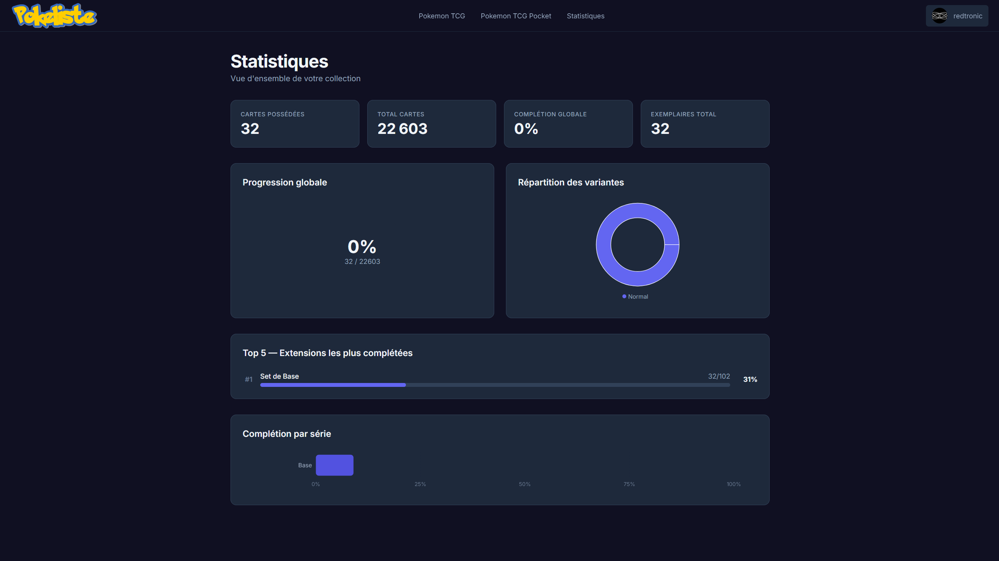

# Pokeliste

Application web full-stack dédiée à la gestion et au suivi d'une collection de cartes Pokémon TCG/TCGP.

Pokeliste permet de consulter les différentes extensions du jeu, gérer les cartes possédées et leurs variantes, suivre sa progression et analyser sa collection grâce à différentes statistiques.





## Fonctionnalités

- Consultation des séries et extensions Pokémon TCG/TCGP
- Gestion des cartes et des variantes possédées
- Authentification via Discord
- Statistiques de progression de la collection
- Synchronisation automatique des données
- Interface adaptée à une utilisation mobile
- 📷 Expérimentation autour de la reconnaissance automatique de cartes à partir de photographies

## Stack technique

### Frontend

- React
- TypeScript
- Tailwind CSS
- React Query
- React Hook Form

### Backend

- NestJS
- TypeScript
- Prisma
- MySQL
- REST API
- JWT / OAuth Discord

### Autres

- Docker
- Python / OpenCV pour la fonctionnalité expérimentale de reconnaissance d'images

## Synchronisation des données

Les données relatives aux séries, extensions et cartes sont synchronisées automatiquement par le backend.

Une synchronisation initiale est également effectuée lorsque la base de données ne contient encore aucune donnée.

## Reconnaissance d'images — expérimentation

Une fonctionnalité expérimentale permet d'essayer d'identifier automatiquement des cartes à partir d'une photographie d'une page de classeur.
L'objectif est de réduire la saisie manuelle nécessaire pour ajouter plusieurs cartes à une collection.
La fonctionnalité repose sur un traitement d'image en Python/OpenCV et fait l'objet de différentes expérimentations et itérations afin d'améliorer la fiabilité des résultats.

## Installation

### Prérequis

- Node.js
- pnpm
- Une base de données MySQL accessible par l'application

### Installation

Cloner le dépôt :

```bash
git clone https://github.com/RedtronicBot/Pokeliste-V2.git
cd Pokeliste-V2
```

Installer les dépendances :

```bash
pnpm install
```

Lancer le frontend en mode développement :

```bash
cd frontend
pnpm dev
```

Lancer le backend en mode développement :

```bash
cd backend
pnpm start:dev
```

Les variables d'environnement nécessaires sont à configurer dans les fichiers .env.

## Déploiement

Le projet utilise Docker pour le build et le déploiement.

Les images sont construites automatiquement à partir des Dockerfile du projet et le déploiement est automatisé via Dockploy.

En développement, le projet est principalement utilisé avec les commandes pnpm dev et pnpm start:dev.

## Objectif du projet

Pokeliste est un projet personnel ayant pour objectif de mettre en pratique le développement d'une application full-stack complète, de la conception de la base de données jusqu'à l'interface utilisateur et au déploiement.
Le projet sert également de terrain d'expérimentation pour explorer différentes problématiques techniques au-delà du développement web classique.
